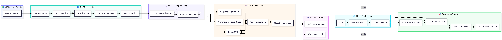
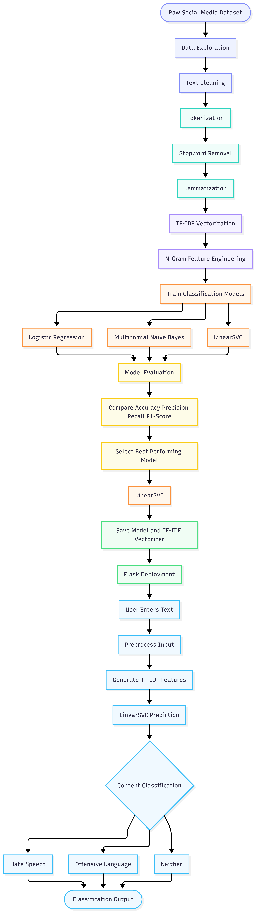

<div align="center">

# 🛡️ Intelligent Content Moderation

### *An NLP and Machine Learning system that automatically detects hate speech, offensive language, and neutral content from user-generated text.*

<p>


</p>

</div>

---

# 📖 Overview

**Intelligent Content Moderation** is an AI-powered Natural Language Processing and Machine Learning application designed to automatically classify user-generated text into three categories:

* 🔴 Hate Speech
* 🟠 Offensive Language
* 🟢 Neither

The project implements a complete end-to-end machine learning pipeline, starting from raw social media text preprocessing and feature engineering to model training, comparative evaluation, and deployment through a Flask web application.

The system uses **TF-IDF vectorization and N-Gram feature engineering** to convert text into numerical representations and evaluates multiple machine learning algorithms to identify the best-performing classification model.

After comparative evaluation, **LinearSVC** was selected as the final model because of its superior performance on sparse, high-dimensional TF-IDF feature representations.

---

# 🎯 Problem Statement

Social media platforms generate millions of user-generated posts every day. Manually identifying harmful, offensive, or abusive content is difficult, time-consuming, and expensive.

Traditional moderation systems may struggle with the large volume and constantly changing nature of online content.

This project aims to automate the initial content moderation process by using **Natural Language Processing and Machine Learning** to identify and classify potentially harmful language.

---

# ✨ Features

### 🛡️ Content Classification

* Hate Speech Detection
* Offensive Language Detection
* Neutral Content Classification
* Real-time text classification

### 🧹 Advanced NLP Preprocessing

* Text Cleaning
* Tokenization
* Stopword Removal
* Lemmatization
* N-Gram Feature Engineering

### 🧠 Machine Learning

* TF-IDF Feature Engineering
* Sparse Matrix Representation
* Multiclass Classification
* Multiple Model Comparison
* Automated prediction using trained models

### 📊 Model Evaluation

* Accuracy comparison
* Precision evaluation
* Recall evaluation
* F1-score evaluation
* Comparative model analysis

### 🌐 Web Application

* Flask-based backend
* Interactive user interface
* Real-time predictions
* Model information dashboard
* Prediction results displayed through a web interface

---

# 🏗️ System Architecture

<p align="center">
  
</p>

The system follows an end-to-end NLP classification architecture.

User text is submitted through the Flask web interface and passed through the same preprocessing and feature engineering pipeline used during model training. The processed text is transformed into TF-IDF features and passed to the trained **LinearSVC classifier**, which predicts one of the three content categories.

---

# 🔄 NLP & Machine Learning Workflow

<p align="center">
  
</p>

The complete machine learning workflow consists of:

1. 📂 Load the labeled social media dataset.
2. 🧹 Clean and preprocess the raw text.
3. 🔤 Tokenize the text.
4. 🚫 Remove unnecessary stopwords.
5. 🌱 Apply lemmatization.
6. 🔢 Generate TF-IDF and N-Gram features.
7. 🧠 Train multiple machine learning models.
8. 📊 Evaluate model performance.
9. 🏆 Select LinearSVC as the final model.
10. 💾 Save the trained model and TF-IDF vectorizer.
11. 🌐 Integrate the model with Flask.
12. 📝 Accept user text through the web interface.
13. 🔍 Transform the input using the saved preprocessing pipeline.
14. 🤖 Generate the predicted content category.
15. 📊 Display the classification result to the user.

---

# 📊 Dataset

The project uses a labeled dataset of **24,783 social media posts** obtained from Kaggle.

The dataset contains three target categories:

| Label | Category           |
| ----: | ------------------ |
| **0** | Hate Speech        |
| **1** | Offensive Language |
| **2** | Neither            |

The dataset contains real-world social media text and is used to train and evaluate the content classification models.

---

# 🧹 NLP Pipeline

The text processing pipeline consists of multiple stages:

```text
Raw Text
    ↓
Text Cleaning
    ↓
Tokenization
    ↓
Stopword Removal
    ↓
Lemmatization
    ↓
TF-IDF Vectorization
    ↓
N-Gram Feature Engineering
    ↓
Machine Learning Model
    ↓
Content Classification
```

---

# 🧠 Machine Learning Models

Three machine learning algorithms were evaluated during the project.

### Logistic Regression

Logistic Regression was used as a baseline multiclass classification model to establish an initial performance benchmark.

### Multinomial Naive Bayes

Multinomial Naive Bayes was evaluated because of its effectiveness for traditional text classification problems involving word-frequency-based features.

### LinearSVC

LinearSVC was selected as the final model after comparative evaluation.

It achieved the highest accuracy and performed effectively with the sparse, high-dimensional feature representation generated by TF-IDF.

---

# 📈 Model Performance

| Model                       |  Accuracy |
| --------------------------- | --------: |
| **Logistic Regression**     | **85.1%** |
| **Multinomial Naive Bayes** | **83.6%** |
| **LinearSVC**               | **87.6%** |

### 🏆 Final Model

**LinearSVC — 87.6% Accuracy**

LinearSVC was selected as the final classification model because it achieved the best overall accuracy among the evaluated models and is well suited for high-dimensional sparse text representations.

---

# 🛠️ Tech Stack

| Category                        | Technologies                                            |
| ------------------------------- | ------------------------------------------------------- |
| **Programming Language**        | Python                                                  |
| **Machine Learning**            | Scikit-Learn                                            |
| **Natural Language Processing** | NLTK                                                    |
| **Data Processing**             | Pandas, NumPy                                           |
| **Feature Engineering**         | TF-IDF, N-Grams                                         |
| **Classification**              | Logistic Regression, Multinomial Naive Bayes, LinearSVC |
| **Backend**                     | Flask                                                   |
| **Frontend**                    | HTML, CSS, JavaScript                                   |
| **Template Engine**             | Jinja2                                                  |
| **Model Storage**               | Pickle                                                  |
| **Dataset**                     | Kaggle                                                  |

---

# 📸 Application Preview

## 🏠 User Interface

<p align="center">
  
</p>

The application provides a simple interface where users can enter text and submit it for content classification.

---

## 🔍 Prediction Demonstration

<p align="center">
  
</p>

The system processes the submitted text and displays the predicted category in real time.

Possible predictions include:

* Hate Speech
* Offensive Language
* Neither

---

## ℹ️ System Information

<p align="center">
  
</p>

The system information section provides details about the underlying machine learning model and NLP pipeline used by the application.

---

# 📂 Project Structure

```text
Intelligent-Content-Moderation/
│
├── app.py
├── final_model.pkl
├── tfidf_vectorizer.pkl
├── requirements.txt
├── README.md
│
├── templates/
│   └── index.html
│
├── static/
│   ├── style.css
│   └── script.js
│
├── notebook/
│   ├── training.ipynb
│   └── labeled_data.csv
│
└── screenshots/
    ├── architecture.png
    ├── workflow.png
    ├── ui_overview.png
    ├── prediction_demo.png
    └── system_information.png
```

---

# ⚙️ Installation

### 1. Clone the Repository

```bash
git clone https://github.com/yourusername/Intelligent-Content-Moderation.git
cd Intelligent-Content-Moderation
```

### 2. Install Dependencies

```bash
pip install -r requirements.txt
```

### 3. Run the Application

```bash
python app.py
```

### 4. Open the Application

Open the following address in your browser:

```text
http://127.0.0.1:5000/
```

---

# 🧪 Model Training

The complete model development process is available in:

```text
notebook/training.ipynb
```

The notebook covers:

* Dataset loading
* Exploratory data analysis
* Text preprocessing
* Feature engineering
* TF-IDF vectorization
* Model training
* Model comparison
* Performance evaluation
* Final model selection
* Model serialization

The trained model and vectorizer are stored as:

```text
final_model.pkl
tfidf_vectorizer.pkl
```

---

# 🔑 Key NLP Techniques

### Text Cleaning

Removes unnecessary characters, symbols, and noise from social media text.

### Tokenization

Breaks text into individual tokens for further processing.

### Stopword Removal

Removes common words that provide limited value for classification.

### Lemmatization

Reduces words to their base forms to improve feature consistency.

### TF-IDF

Converts text into numerical feature vectors based on the importance of terms within the dataset.

### N-Gram Analysis

Captures combinations of words to preserve additional contextual information beyond individual terms.

---

# 🎓 Learning Outcomes

Through this project, I gained practical experience in:

* Natural Language Processing
* Text Preprocessing
* TF-IDF Feature Engineering
* N-Gram Analysis
* Sparse Matrix Representation
* Multiclass Machine Learning
* Model Comparison
* Precision, Recall and F1-Score Evaluation
* Handling Imbalanced Datasets
* Flask Web Development
* Machine Learning Model Deployment
* End-to-End ML Application Development

---

# ⚠️ Challenges Faced

### Class Imbalance

The dataset contains uneven distributions across different content categories, making minority-class detection more challenging.

### Similar Language Patterns

Hate speech and offensive language can contain semantically similar expressions, making accurate classification difficult.

### Noisy Social Media Text

Social media content often contains abbreviations, misspellings, slang, special characters, and other forms of noise.

### Minority-Class Detection

Improving detection of less-represented categories while maintaining overall model performance was an important challenge.

---

# 🚀 Future Enhancements

* 🤗 BERT-based Text Classification
* 🧠 Transformer-Based Models
* 🔍 Explainable AI for Predictions
* 📊 Prediction Confidence Scores
* 📈 Real-Time Moderation Dashboard
* 🔌 REST API Development
* ☁️ Cloud Deployment
* 👥 User Analytics Dashboard
* 📱 Moderation Management Interface
* 🌍 Multilingual Content Moderation

---

# 👩‍💻 Author

**N Sai Niharika**

Developed as an NLP and Machine Learning project focused on intelligent content moderation, hate speech detection, and offensive language classification.

---

# 📄 License

This project is intended for educational, research, and learning purposes.
