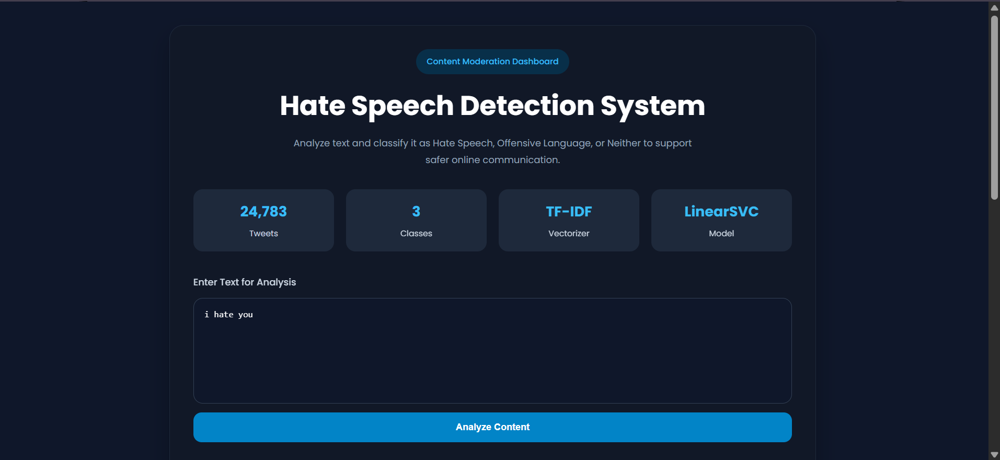
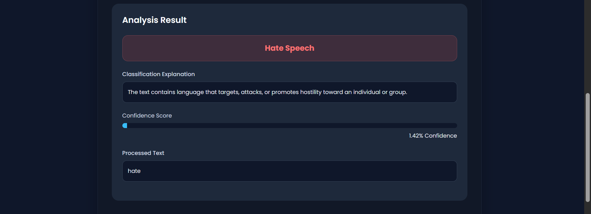
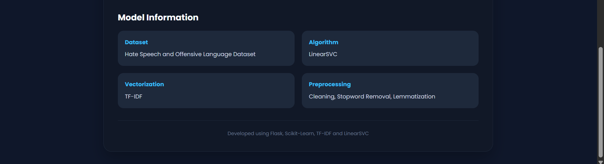

# Intelligent Content Moderation using NLP and Machine Learning

## Overview

Intelligent Content Moderation is an AI-powered Natural Language Processing (NLP) system designed to automatically classify user-generated text into:

* Hate Speech
* Offensive Language
* Neither

The project implements a complete machine learning pipeline including data preprocessing, feature engineering, model comparison, evaluation, and deployment using Flask.

The goal is to assist content moderation systems by automatically identifying harmful or offensive content in user-generated text.

---

## Application Screenshots

### User Interface Overview



### Prediction Demonstration



### System Information



---

## Problem Statement

Social media platforms generate millions of user posts daily. Manual moderation of harmful content is difficult, time-consuming, and expensive.

This project aims to automate content moderation by detecting and classifying harmful language using Natural Language Processing and Machine Learning techniques.

---

## Features

* Hate Speech Detection
* Offensive Language Detection
* Neutral Content Classification
* Advanced Text Preprocessing Pipeline
* TF-IDF Feature Engineering
* N-Gram Analysis
* Multiple Model Comparison
* Flask-Based Web Application
* Interactive User Interface
* Real-Time Text Classification
* Model Information Dashboard

---

## Dataset

The dataset consists of labeled social media posts categorized into:

| Label | Category           |
| ----- | ------------------ |
| 0     | Hate Speech        |
| 1     | Offensive Language |
| 2     | Neither            |

Dataset Size: **24,783 tweets**

The dataset was obtained from Kaggle and contains real-world social media text used for hate speech and offensive language detection research.

---

## NLP Pipeline

```text
Raw Text
   ↓
Text Cleaning
   ↓
Tokenization
   ↓
Stopword Removal
   ↓
Lemmatization
   ↓
TF-IDF Vectorization
   ↓
Model Training
   ↓
Prediction
```

---

## Machine Learning Models Evaluated

### Logistic Regression

Used as a baseline classifier for multiclass text classification.

### Multinomial Naive Bayes

A probabilistic machine learning algorithm commonly used in NLP applications.

### LinearSVC

Selected as the final model due to its superior performance on sparse high-dimensional TF-IDF feature vectors.

---

## Model Performance

| Model                   | Accuracy |
| ----------------------- | -------- |
| Logistic Regression     | 85.1%    |
| Multinomial Naive Bayes | 83.6%    |
| LinearSVC               | 87.6%    |

### Final Model

**LinearSVC**

The model was selected after comparative evaluation because it achieved the highest overall performance and handled sparse TF-IDF features effectively.

---

## Technologies Used

### Programming Language

* Python

### Machine Learning & NLP

* Scikit-Learn
* NLTK
* NumPy
* Pandas

### Web Development

* Flask
* HTML
* CSS
* JavaScript
* Jinja2

---

## Key NLP Techniques Used

* Text Cleaning
* Tokenization
* Stopword Removal
* Lemmatization
* TF-IDF Vectorization
* N-Gram Feature Engineering
* Sparse Matrix Representation
* Multiclass Classification

---

## Project Structure

```text
Intelligent-Content-Moderation/
│
├── app.py
├── final_model.pkl
├── tfidf_vectorizer.pkl
├── requirements.txt
├── README.md
│
├── templates/
│   └── index.html
│
├── static/
│   ├── style.css
│   └── script.js
│
├── notebook/
│   └── training.ipynb
│   └── labeled_data.csv 
└── screenshots/
    ├── ui_overview.png
    ├── prediction_demo.png
    └── system_information.png
```

---

## Installation

### Clone Repository

```bash
git clone https://github.com/yourusername/Intelligent-Content-Moderation.git
```

### Navigate to Project Folder

```bash
cd Intelligent-Content-Moderation
```

### Install Dependencies

```bash
pip install -r requirements.txt
```

### Run Application

```bash
python app.py
```

### Open Browser

```text
http://127.0.0.1:5000/
```

---

## Key Learnings

* Natural Language Processing Fundamentals
* Feature Engineering for Text Data
* TF-IDF Vectorization
* Sparse Matrix Representation
* Machine Learning Model Comparison
* Precision, Recall and F1-Score Evaluation
* Handling Imbalanced Datasets
* Flask Deployment
* End-to-End Machine Learning Pipeline Development

---

## Challenges Faced

* Class imbalance in the dataset
* Distinguishing Hate Speech from Offensive Language
* Misclassification of semantically similar text
* Handling noisy social media text
* Improving minority-class detection performance

---

## Future Improvements

* BERT Integration
* Transformer-Based Classification
* Explainable AI Features
* Confidence Scoring
* Real-Time Moderation Dashboard
* REST API Development
* Cloud Deployment
* User Analytics Dashboard

---

## Author

**N Sai Niharika**

Developed as an NLP and Machine Learning project focused on intelligent content moderation, hate speech detection, and offensive language classification.

---

## License

This project is intended for educational, research, and learning purposes.
